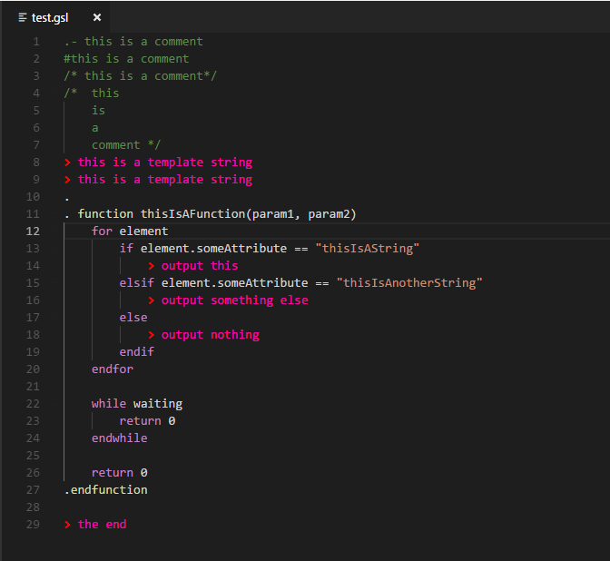

vscode-gsl
==========

A language extension for [GSL](https://github.com/zeromq/gsl) [General Schema Language](https://imatix-legacy.github.io/gslgen/gsldoc4.htm) origianlly developed by [iMatix Corporation](http://www.imatix.com). (see also [here](https://imatix-legacy.github.io/gslgen/), and [here](https://github.com/imatix/gsl))

Features
--------

This extension currently contributes a language, grammar, and theme.  It's ambitions are primarily to add syntax highlighting to gsl script files to easily distinguish script elements from template text.

Requirements
------------

There are currently no special requirements or dependencies for this extension, but if any are added in the future details on how to install and configure them will be placed here.

Extension Settings
------------------

This extension currently does not add any VS Code settings through the `contributes.configuration` extension point.

Known Issues
------------

- The grammar is incomplete and perhaps incorrect as this is the developer's first attempt at such an exercise.

Release Notes
-------------

1.0.0

- Initial release
